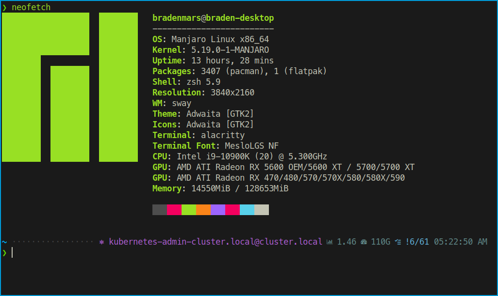

# My Dotfiles

My current system configuration that I share between systems.

Contains various scripts, config files, packages, etc.
Does not contain everything by any means, but I add items as I can.

Powered by [dotdrop](https://github.com/deadc0de6/dotdrop)

    

